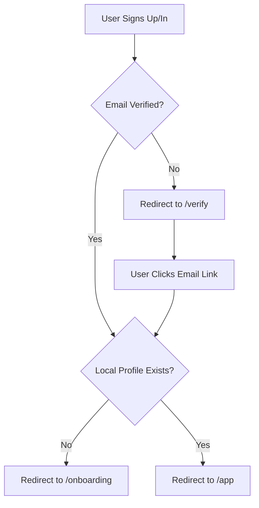

# Auth Pages & Supabase Integration

## Overview

Implement the remaining auth infrastructure: Supabase client/server utilities, all auth pages, and update existing layouts to integrate Supabase authentication.

## Architecture

- **Supabase Auth**: Email/password with email verification
- **Session Management**: Cookie-based via `@supabase/ssr`
- **Client Pattern**: Client components for auth pages using `useActionState` or form actions where appropriate
- **Server Guards**: Server-side check in `app/app/(shell)/layout.tsx` to prevent client flicker
- **Onboarding Flow**: After signup/login, check if local profile exists; if not, redirect to `/onboarding`

## Files to Create

### Supabase Utilities

- `lib/supabase/client.ts` - Browser Supabase client using `createBrowserClient` from `@supabase/ssr`
- `lib/supabase/server.ts` - Server Supabase client using `createServerClient` from `@supabase/ssr` with cookie helpers

### Auth Pages

- `app/login/page.tsx` - Sign in page with email/password form, uses `AuthLayout` and `AuthCard`
- `app/signup/page.tsx` - Sign up page with name, email, password, confirm password
- `app/forgot-password/page.tsx` - Password reset request page
- `app/verify/page.tsx` - Handles email verification tokens and password reset confirmations
- `app/logout/route.ts` - Route handler that signs out and redirects to `/`

### Auth Helpers

- `lib/auth/actions.ts` - Server actions for auth operations (signIn, signUp, resetPassword, logout)

## Files to Modify

### App Layout

- `app/app/(shell)/layout.tsx` - Convert to server component, add server-side auth check using `lib/supabase/server.ts`, redirect to `/login` if not authenticated

### Landing Page  

- `app/page.tsx` - Update login button/CTA to route to `/login` instead of `/app`

### Package Dependencies

- `package.json` - Add `@supabase/supabase-js` and `@supabase/ssr` dependencies

### Documentation

- `README.md` - Add Supabase setup instructions and environment variables
- `.env.example` - Add `NEXT_PUBLIC_SUPABASE_URL` and `NEXT_PUBLIC_SUPABASE_ANON_KEY`

## Implementation Details

### Supabase Client/Server Pattern

**Client (`lib/supabase/client.ts`):**

```typescript
import { createBrowserClient } from '@supabase/ssr'
// Uses browser cookies for session management
```

**Server (`lib/supabase/server.ts`):**

```typescript
import { createServerClient } from '@supabase/ssr'
import { cookies } from 'next/headers'
// Uses Next.js cookies() API for server-side session
```

### Auth Pages Structure

All auth pages use:

- `AuthLayout` wrapper (already created)
- `AuthCard` component (already created)  
- `FormError` and `FormSuccess` components (already created)
- Existing `Input` and `Button` components
- Copy deck from spec (titles, subtitles, CTAs, error messages)

### Login Flow

1. User submits email/password
2. Server action calls Supabase `signIn`
3. On success: check if local profile exists → redirect to `/onboarding` or `/app` based on redirect param
4. On error: display error message

### Signup Flow

1. User submits name, email, password, confirm password
2. Validate password match client-side
3. Server action calls Supabase `signUp`
4. If email verification required: redirect to `/verify`
5. If session exists: check local profile → redirect to `/onboarding` or `/app`

### Verify Flow

1. Handle email confirmation tokens from URL search params
2. Handle password reset tokens
3. Show appropriate success/error states
4. Redirect to `/login` or `/onboarding` based on flow

### Forgot Password Flow

1. User submits email
2. Server action calls Supabase `resetPasswordForEmail`
3. Show success message (no user enumeration)

### Onboarding Integration

Per the spec: "After signup/login, if no local profile exists, redirect to `/onboarding` to create it."

This means checking localStorage for existing user profile after successful auth. If not found, redirect to `/onboarding` to create the local profile (which will continue to use LocalStorage as specified).

## Routing Logic



## Acceptance Criteria

- All auth pages follow the visual spec (gradient background, card styling, copy)
- Login/signup forms validate inputs client-side
- Server actions handle Supabase auth operations
- Error messages match the copy deck
- Authenticated users are redirected away from auth pages (handled by middleware)
- Unauthenticated users accessing `/app/*` are redirected to login with redirect param
- Onboarding flow triggered after first-time auth when no local profile exists