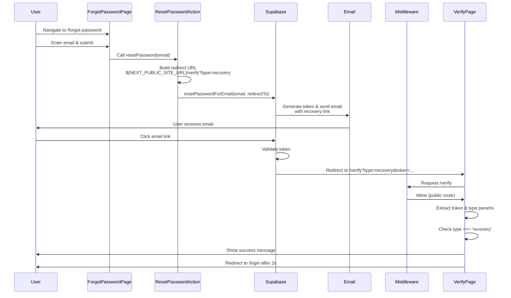
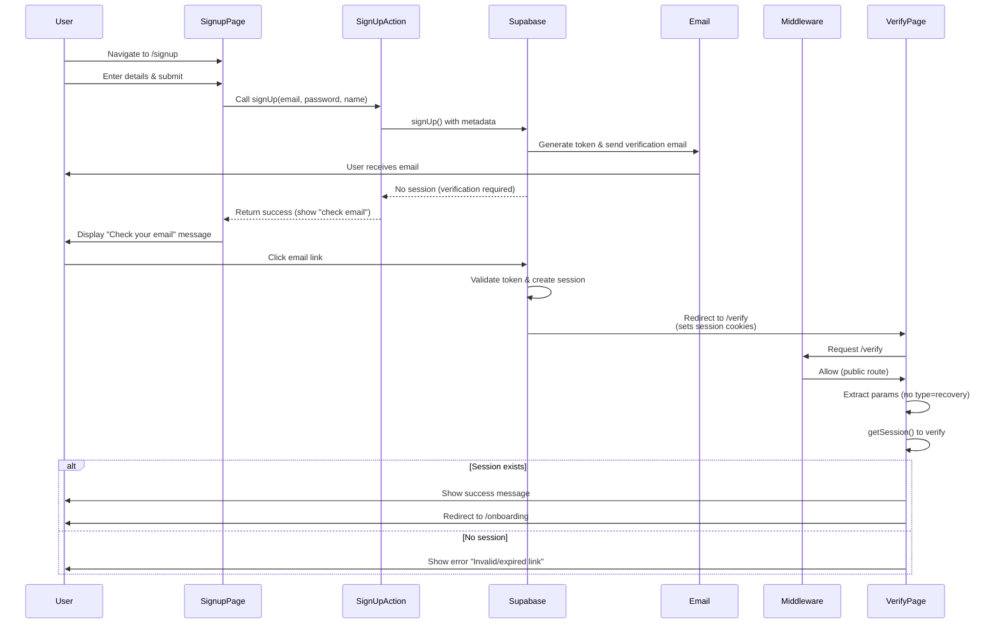

# Code Flow Reference: Redirect URL Flows

This document details the step-by-step authentication flows involving redirect URLs, specifically password reset and email verification processes.

---

## Password Reset Flow

### Overview
When a user forgets their password, they can request a reset link via email. The link contains a recovery token that must match Supabase's redirect URL configuration.

### Step-by-Step Flow

#### Step 1: User Initiates Password Reset
**Location:** `app/forgot-password/page.tsx`

- User navigates to `/forgot-password`
- User enters their email address in the form
- Form submission triggers the `resetPassword` server action via `useActionState`

**Code Reference:**
```16:16:app/forgot-password/page.tsx
  const [state, formAction, pending] = useActionState(resetPassword, { error: null, success: false });
```

#### Step 2: Server Action Processes Request
**Location:** `lib/auth/actions.ts` (lines 67-81)

- `resetPassword` server action is called with the form data
- Extracts email from FormData
- Creates Supabase server client
- Calls `supabase.auth.resetPasswordForEmail()` with redirect URL

**Code Reference:**
```67:81:lib/auth/actions.ts
export async function resetPassword(_prevState: any, formData: FormData) {
  const supabase = await createClient();

  const email = formData.get('email') as string;

  const { error } = await supabase.auth.resetPasswordForEmail(email, {
    redirectTo: `${process.env.NEXT_PUBLIC_SITE_URL || 'http://localhost:3000'}/verify?type=recovery`,
  });

  if (error) {
    return { error: error.message, success: false };
  }

  return { success: true, error: null };
}
```

**Key Details:**
- Redirect URL constructed as: `${NEXT_PUBLIC_SITE_URL}/verify?type=recovery`
- Falls back to `http://localhost:3000` if `NEXT_PUBLIC_SITE_URL` is not set
- The `type=recovery` query parameter identifies this as a password reset flow

#### Step 3: Supabase Generates and Sends Email
**Location:** Supabase Dashboard (Email Templates)

- Supabase generates a recovery token
- Creates a secure email link containing:
  - Recovery token (as hash or query parameter)
  - Redirect URL: `${NEXT_PUBLIC_SITE_URL}/verify?type=recovery`
- Email is sent to the user's email address

**Supabase Configuration Requirements:**
1. **Redirect URL Pattern Matching:**
   - The redirect URL passed to `resetPasswordForEmail()` **must match** a pattern configured in Supabase Dashboard
   - Navigate to: **Authentication > URL Configuration > Redirect URLs**
   - Add redirect URL pattern: `${NEXT_PUBLIC_SITE_URL}/verify?type=recovery`
   - For production: `https://yourdomain.com/verify?type=recovery`
   - For development: `http://localhost:3000/verify?type=recovery`
   - Wildcards are supported: `https://*.vercel.app/verify*`

2. **Email Template:**
   - Supabase uses the "Reset Password" email template
   - Template contains: `{{ .ConfirmationURL }}` which includes the redirect URL
   - The link format will be: `https://yourproject.supabase.co/auth/v1/verify?token=...&type=recovery&redirect_to=${NEXT_PUBLIC_SITE_URL}/verify?type=recovery`

#### Step 4: User Clicks Email Link
- User receives email and clicks the recovery link
- Browser navigates to Supabase's verification endpoint first
- Supabase validates the token and redirects to: `${NEXT_PUBLIC_SITE_URL}/verify?type=recovery&token=...`
- The `type=recovery` parameter identifies this as a password reset flow
- The `token` parameter contains the recovery token

**URL Pattern:**
```
https://yourdomain.com/verify?type=recovery&token=<recovery_token>
```

#### Step 5: Middleware Processing
**Location:** `middleware.ts` (lines 14, 91-103)

- Middleware intercepts the request to `/verify`
- `/verify` is **explicitly allowed** for authenticated and unauthenticated users
- No redirect occurs - request proceeds to the verification page

**Code Reference:**
```14:14:middleware.ts
 * - /verify → allow (handles verification tokens)
```

#### Step 6: Verification Page Processes Token
**Location:** `app/verify/page.tsx` (lines 12-72)

- Page extracts `token` and `type` from URL search parameters
- Client-side component uses `useSearchParams()` to get query params
- Checks if `type === 'recovery'` to determine flow type

**Code Reference:**
```12:17:app/verify/page.tsx
export default function VerifyPage() {
  const router = useRouter();
  const searchParams = useSearchParams();
  const token = searchParams.get('token');
  const type = searchParams.get('type'); // 'recovery' for password reset, null for email verification
  const [status, setStatus] = useState<'loading' | 'success' | 'error'>('loading');
  const [message, setMessage] = useState<string | null>(null);
```

#### Step 7: Recovery Token Handling
**Location:** `app/verify/page.tsx` (lines 42-48)

- When `type === 'recovery'`:
  - Currently shows success message (note: full password reset implementation may need additional steps)
  - Displays: "Password reset link verified. Please check your email for further instructions."
  - After 2 seconds, redirects to `/login`

**Code Reference:**
```42:48:app/verify/page.tsx
        if (type === 'recovery') {
          // Password reset flow - Supabase sends a code that can be used to reset password
          setStatus('success');
          setMessage('Password reset link verified. Please check your email for further instructions.');
          setTimeout(() => {
            router.push('/login');
          }, 2000);
```

**Note:** The current implementation validates the recovery link but doesn't handle the actual password reset form. A complete implementation would:
1. Store the recovery token in session/storage
2. Redirect to a password reset form (e.g., `/reset-password?token=...`)
3. Allow user to enter new password
4. Use `supabase.auth.updateUser({ password: newPassword })` with the token

#### Step 8: Error Handling
**Location:** `app/verify/page.tsx` (lines 22-26, 65-68)

- If `token` is missing: shows error "Invalid verification link"
- If verification fails: shows error "Invalid or expired verification link"
- All errors redirect to `/login` after 2 seconds

### Flow Diagram



---

## Email Verification Flow

### Overview
When a user signs up, Supabase sends a verification email. Clicking the email link confirms the email address and activates the account.

### Step-by-Step Flow

#### Step 1: User Signs Up
**Location:** `app/signup/page.tsx`

- User navigates to `/signup`
- User enters: name, email, password, confirm password
- Form validates password match client-side
- Form submission triggers the `signUp` server action via `useActionState`

**Code Reference:**
```18:31:app/signup/page.tsx
  const [state, formAction, pending] = useActionState(signUp, { error: null, success: false });

  const handleSubmit = async (formData: FormData) => {
    const password = formData.get('password') as string;
    const confirmPassword = formData.get('confirmPassword') as string;

    if (password !== confirmPassword) {
      setPasswordMatchError('Passwords do not match.');
      return;
    }

    setPasswordMatchError(null);
    formAction(formData);
  };
```

#### Step 2: Server Action Processes Signup
**Location:** `lib/auth/actions.ts` (lines 34-65)

- `signUp` server action is called with form data
- Extracts: email, password, name
- Creates Supabase server client
- Calls `supabase.auth.signUp()` with email, password, and user metadata

**Code Reference:**
```34:65:lib/auth/actions.ts
export async function signUp(_prevState: any, formData: FormData) {
  const supabase = await createClient();

  const data = {
    email: formData.get('email') as string,
    password: formData.get('password') as string,
    name: formData.get('name') as string,
  };

  const { error, data: authData } = await supabase.auth.signUp({
    email: data.email,
    password: data.password,
    options: {
      data: {
        name: data.name,
      },
    },
  });

  if (error) {
    return { error: error.message, success: false };
  }

  // If session exists (email verification disabled), redirect to onboarding or app
  if (authData.session) {
    revalidatePath('/', 'layout');
    redirect('/onboarding');
  }

  // Otherwise, return success (will show verify message)
  return { success: true, error: null };
}
```

**Key Details:**
- User metadata (name) is stored in `options.data`
- If email verification is **disabled** in Supabase, a session is created immediately and user is redirected to `/onboarding`
- If email verification is **enabled** (default), no session is created and the function returns success (showing "check your email" message)

#### Step 3: Signup Success UI
**Location:** `app/signup/page.tsx` (lines 34-52)

- When `state.success === true`:
  - Shows "Check your email" message
  - Displays: "Please check your email and click the confirmation link to complete your registration."
  - Provides "Back to login" button

**Code Reference:**
```34:52:app/signup/page.tsx
  // Redirect on success
  if (state?.success) {
    return (
      <AuthLayout>
        <AuthCard
          title="Check your email"
          subtitle="We sent a confirmation link to finish setup."
        >
          <FormSuccess message="Please check your email and click the confirmation link to complete your registration." />
          <Button
            variant="gradient"
            className="w-full mt-4"
            onClick={() => router.push('/login')}
          >
            Back to login
          </Button>
        </AuthCard>
      </AuthLayout>
    );
  }
```

#### Step 4: Supabase Generates and Sends Verification Email
**Location:** Supabase Dashboard (Email Templates & URL Configuration)

- Supabase generates a verification token
- Creates a secure email link
- **Email redirect URL is configured in Supabase Dashboard**, not in code
- Navigate to: **Authentication > URL Configuration > Site URL**
- The Site URL is used as the base for email verification redirects
- Default redirect: `${SITE_URL}/verify` (without query parameters)

**Supabase Configuration Requirements:**

1. **Site URL Configuration:**
   - Navigate to: **Authentication > URL Configuration**
   - Set **Site URL**: Your production URL (e.g., `https://yourdomain.com`)
   - This is the base URL used for email verification redirects

2. **Redirect URL Pattern (if needed):**
   - If you want to add query parameters, configure redirect URL patterns
   - Add pattern: `${SITE_URL}/verify` or `${SITE_URL}/verify*`
   - Example: `https://yourdomain.com/verify*`

3. **Email Template:**
   - Supabase uses the "Confirm Signup" email template
   - Template contains: `{{ .ConfirmationURL }}` which redirects to your Site URL
   - The link format: `https://yourproject.supabase.co/auth/v1/verify?token=...&type=signup&redirect_to=${SITE_URL}/verify`

#### Step 5: User Clicks Email Link
- User receives email and clicks the verification link
- Browser navigates to Supabase's verification endpoint first
- Supabase validates the token, confirms the email, and creates a session
- Supabase redirects to: `${SITE_URL}/verify?token=...&type=signup`
- The `token` parameter may be present (for custom handling)
- The `type=signup` parameter indicates email verification flow
- **Important:** Supabase may also set session cookies during this redirect

**URL Pattern:**
```
https://yourdomain.com/verify?token=<verification_token>&type=signup
```

Or simpler:
```
https://yourdomain.com/verify
```

(Note: Supabase may include token in the hash `#access_token=...` instead of query params)

#### Step 6: Middleware Processing
**Location:** `middleware.ts` (lines 14, 91-103)

- Middleware intercepts the request to `/verify`
- `/verify` is **explicitly allowed** for all users (authenticated or not)
- Session cookies from Supabase redirect may be present
- No redirect occurs - request proceeds to the verification page

#### Step 7: Verification Page Processes Token
**Location:** `app/verify/page.tsx` (lines 12-72)

- Page extracts `token` and `type` from URL search parameters
- If `type` is not `'recovery'`, it's treated as email verification
- Creates Supabase client (client-side)
- Attempts to get the current session

**Code Reference:**
```49:64:app/verify/page.tsx
        } else {
          // Email verification - check if we can get the session
          const { data: { session }, error } = await supabase.auth.getSession();
          
          if (error || !session) {
            setStatus('error');
            setMessage('Invalid or expired verification link. Please request a new one.');
            return;
          }

          setStatus('success');
          setMessage('Email verified successfully! Redirecting...');
          setTimeout(() => {
            router.push('/onboarding');
          }, 2000);
        }
```

**Key Details:**
- Uses `supabase.auth.getSession()` to check if Supabase has set a valid session
- If session exists: verification was successful
- If no session: link is invalid or expired
- Success message: "Email verified successfully! Redirecting..."
- Redirects to `/onboarding` after 2 seconds

#### Step 8: Onboarding Redirect
**Location:** `app/verify/page.tsx` (line 62)

- After successful email verification, user is redirected to `/onboarding`
- This is where the user creates their local profile
- The session is already established, so user is authenticated

#### Step 9: Error Handling
**Location:** `app/verify/page.tsx` (lines 22-26, 53-56, 65-68)

- If `token` is missing and no session: shows error "Invalid verification link"
- If `getSession()` returns no session: shows error "Invalid or expired verification link"
- All errors allow user to click "Back to login"

### Flow Diagram



---

## Environment Variables

### Required Variables

**`NEXT_PUBLIC_SITE_URL`** (optional, but recommended)
- **Usage:** Password reset redirect URL construction
- **Location:** `lib/auth/actions.ts` line 73
- **Format:** Full URL including protocol (e.g., `https://yourdomain.com`)
- **Default:** Falls back to `http://localhost:3000` if not set
- **Production:** Set to your production domain
- **Development:** Can omit (uses localhost default)

**Example:**
```env
NEXT_PUBLIC_SITE_URL=https://giftpal.vercel.app
```

### Supabase Dashboard Configuration

The following must be configured in **Supabase Dashboard > Authentication > URL Configuration**:

1. **Site URL:**
   - Used as base for email verification redirects
   - Example: `https://yourdomain.com`

2. **Redirect URLs:**
   - Must include patterns matching the redirect URLs used in code
   - For password reset: `${SITE_URL}/verify?type=recovery` or `${SITE_URL}/verify*`
   - For email verification: `${SITE_URL}/verify` or `${SITE_URL}/verify*`
   - Wildcards are supported: `https://*.vercel.app/verify*`

---

## URL Pattern Summary

### Password Reset
```
Email Link → Supabase Verify → ${NEXT_PUBLIC_SITE_URL}/verify?type=recovery&token=...
```

### Email Verification
```
Email Link → Supabase Verify → ${SITE_URL}/verify (with session cookies)
```

Both flows converge at `/verify`, which differentiates them using the `type` query parameter.

---

## Error Scenarios

### Password Reset Errors

1. **Invalid email:**
   - Error shown in `forgot-password` page
   - Message: Error from Supabase API

2. **Missing token in URL:**
   - Error shown in `verify` page
   - Message: "Invalid verification link."
   - Redirects to `/login`

3. **Expired/invalid token:**
   - Error shown in `verify` page
   - Message: "Invalid or expired verification link."
   - Redirects to `/login`

### Email Verification Errors

1. **Signup API error:**
   - Error shown in `signup` page
   - Message: Error from Supabase API

2. **Missing/invalid session after click:**
   - Error shown in `verify` page
   - Message: "Invalid or expired verification link. Please request a new one."
   - Redirects to `/login`

3. **Email already verified:**
   - Supabase handles this gracefully
   - Session may already exist
   - User proceeds normally

---

## Testing Checklist

### Password Reset Flow

- [ ] Submit form on `/forgot-password` with valid email
- [ ] Verify email is received
- [ ] Click email link
- [ ] Verify redirect to `/verify?type=recovery&token=...`
- [ ] Verify success message appears
- [ ] Verify redirect to `/login` after 2 seconds
- [ ] Test with expired token (should show error)
- [ ] Test with missing token (should show error)

### Email Verification Flow

- [ ] Submit signup form with new email
- [ ] Verify "Check your email" message appears
- [ ] Verify email is received
- [ ] Click email link
- [ ] Verify redirect to `/verify` (or `/verify?token=...`)
- [ ] Verify success message appears
- [ ] Verify redirect to `/onboarding` after 2 seconds
- [ ] Verify session is established (user is authenticated)
- [ ] Test with expired/invalid link (should show error)

### Configuration Verification

- [ ] `NEXT_PUBLIC_SITE_URL` is set correctly in production
- [ ] Supabase Site URL matches production domain
- [ ] Supabase Redirect URLs include `/verify*` patterns
- [ ] Email templates are configured correctly
- [ ] Both flows work in development (localhost)
- [ ] Both flows work in production (deployed domain)

---

## Notes

1. **Password Reset Implementation:** The current code validates the recovery link but doesn't include a password reset form. Consider adding a `/reset-password` route that accepts the token and allows users to set a new password using `supabase.auth.updateUser()`.

2. **Email Verification Token Handling:** Supabase may pass the access token in the URL hash (`#access_token=...`) instead of query parameters. The current implementation relies on session cookies set during the redirect, which is the recommended approach.

3. **Middleware:** The `/verify` route is explicitly allowed in middleware to handle both authenticated (with session) and unauthenticated (with token) requests.

4. **Local Development:** For local testing, ensure `http://localhost:3000/verify*` is added to Supabase Redirect URLs configuration.

5. **Session Management:** Email verification flow relies on Supabase setting session cookies during the redirect. The verify page checks for these cookies using `getSession()`.
